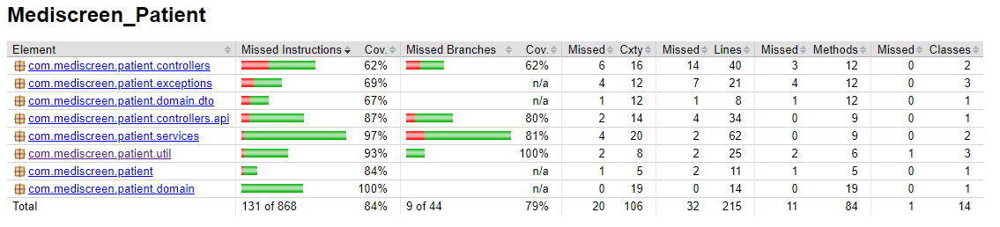
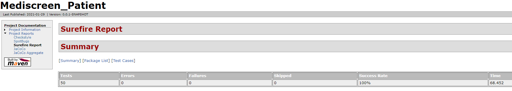

 * * *    * * *  

# Mediscreen_Abernathy - Patient

OpenClassrooms - Project 9  
Mediscreen_Abernathy App - Patient microservice  

---

This application is made in two parts: 
- RestControllers for the API REST
- Controllers with Spring MVC for Thymeleaf frontend interface

---

Mediscreen_Abernathy is composed of 4 microservices:

1. **API Gateway**: https://github.com/ludovictuccio/Mediscreen_Abernathy_Api-Gateway  
The API Gateway, used on port 8080.  
Used for the API REST.  
---

2. **Patient**: https://github.com/ludovictuccio/Mediscreen_Abernathy_Patient  
The microservice used for access to patient's medical record (search, consultation, creation, update), used on port 8081.  
---

3. **Notes**: https://github.com/ludovictuccio/Mediscreen_Abernathy_Notes  
The microservice used for add patient's notes, used on port 8082.  
---

4. **Reports**: https://github.com/ludovictuccio/Mediscreen_Abernathy_Reports  
The microservice used for generate patient's diabetes assessment reports, used on port 8083.  
---

**Feign** is used for the microservices relations.

---

## Informations / Technical

- **Java** 11 - **Maven** - **Spring Boot** 2.4.1
- **Spring Data Jpa** - **Hibernate** 5
- **MySql** 8 - **MongoDB** - **Jasypt**
- **Thymeleaf** - **Bootstrap** v4.3.1 - **JQuery**
- **Docker** - **Docker-Compose** - **Feign**
- **Swagger** 3 - **Devtools** - **ModelMapper** - **Javax Validation**
- **JaCoCo** - **Surefire** - **Checkstyle** - **Spotbugs** - **Lombok**

## Installing

1. Install **Java**: https://www.oracle.com/java/technologies/javase-downloads.html  

2. Install **Maven**: https://maven.apache.org/install.html

3. Install **Lombok** in your IDE before import project: https://www.baeldung.com/lombok-ide  
(you must execute an external JAR)

4. Install **MySql**: https://dev.mysql.com/downloads/installer/

5. Install **MongoDb**: https://docs.mongodb.com/manual/administration/install-community/

## Databases - SQL & NOSQL

- **Microservice Patient**:  
the file **schema-patients.sql** (available in *"/src/main/resources"*) contains scrypt SQL to create patients database
- **Microservice Notes**:   
in *"/src/main/resources"* : the file **data-test.json** contains data tests and **data-notes.CSV** contains real datas for the ten patients (UTF8 applied)

## To run microservice with:

- **IDE**: refer to **application.properties** to set valid proxies url with localhost

- **Docker**: the **application.properties** is written for the Docker deploiement. The Dockerfile will build the microservice and run the jar to run it.

## For Docker deploiement:

1. Install Docker Desktop:  
https://docs.docker.com/docker-for-windows/ or https://docs.docker.com/docker-for-mac/

2. The **Dockerfile** will build the microservice and run the jar to run it.  
To use it, you must run on the package root: 
- `docker build -t mediscreen-patient .`
- `docker run -d -p 8081:8081 mediscreen-patient`

3. To run all microservices on the same network, with a Docker-Compose deploiement:  
If you want to deploy all TourGuide microservices, use the **docker-compose.yml** on the package root, after each Dockerfile deployment for the 4 microservices, running:
- `docker network create tourguide-net`
- `docker-compose up -d`

This will launch:
- MySql database on the port 3307
- MongoDB local server and use a database named *mediscreen-docker* and collection *notes*

## API documentation

- **Swagger 3:** http://localhost:8081/swagger-ui/index.html#/

## API REST Endpoints

### Patient microservice

> **POST** - Add new patient's medical record  
http://localhost:8081/api/patient  
**Need body** with: lastName, firstName, birthdate(yyyy-MM--dd), sex, address, phone & usename

> **PUT** - Update patient's personal informations 
http://localhost:8081/api/patient  
**Need body** with: lastName, firstName, birthdate(yyyy-MM--dd), sex, address, phone & usename

> **GET** - Get all patient's list  
http://localhost:8081/api/patient/list  

> **GET** - Search a patient by lastName  
http://localhost:8081/api/patient/searchPatient  
**Need parameter**: lastName  

> **GET** - Get a patient's medical record  
http://localhost:8081/api/patient  
**Need parameter**: patId = the patient id  

### Notes microservice

> **POST** - Add new patient's note  
http://localhost:8082/api/note  
**Need body** with: 'lastName', 'firstName', 'note'  

> **PUT** - Update a patient's note  
http://localhost:8082/api/note  
**Need parameter**: id = the note's id  
**Need body** with: 'lastName', 'firstName', 'note'  

> **GET** - Get all notes list  
http://localhost:8082/api/note/all  

> **GET** - Get all patient's notes list  
http://localhost:8082/api/note  
**Need parameter**: 'lastName' & 'firstName'  

> **GET** - Get all patient's notes DTO  
http://localhost:8082/api/note/getAllPatientsNoteDto  
**Need parameter**: 'lastName' & 'firstName'  

### Reports microservice

> **GET** - Get patient's personal informations DTO  
http://localhost:8083/api/reports/getPatientPersonalInformations  
**Need parameter**: patId = the patient's id  

> **GET** - Get all patient's notes DTO list  
http://localhost:8083/api/reports/getAllPatientsNoteDto  
**Need parameter**: lastName & firstName  

> **GET** - Get patient's diabetes assesment report  
http://localhost:8083/api/reports/report  
**Need parameter**: patId = the patient's id  

## Testing

The app has unit tests and integration tests written.  
You must launch `mvn test` or build with `mvn site` (all reports available in *"/target"*).

## JaCoCo report

## Surefire report

